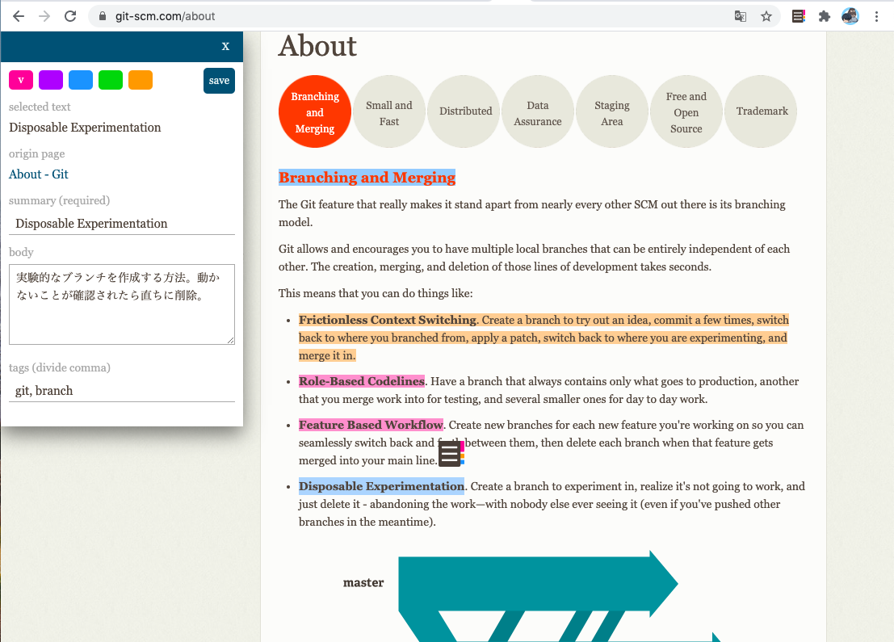
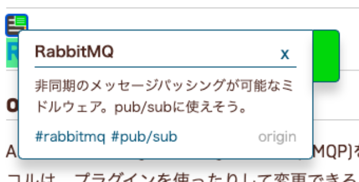

# page note

## overview

Google ChromeのExtension。
Google Chromeを利用したとき、Webページに注釈や要約を持たせることができる拡張機能である。





## features

- ノート
    - 作成
    - 閲覧
    - 編集
    - 削除
    - 検索
- データ
    - インポート(json)
    - エクスポート(json)
- 本文の自動要約
- 設定

## how to install

本リポジトリの`demo`ブランチにて、より詳細なインストールのガイドを作成しています。

npmがインストールされている必要があるため、インストールされていない場合は[こちら](https://nodejs.org/en/)からインストールする。

```shell
$ git clone https://github.com/akubi0w1/page-note.git
$ cd page-note
$ npm install
```

[TextSummarizationAPI](https://a3rt.recruit-tech.co.jp/product/TextSummarizationAPI/)公式より、API KEYを発行する。メールにて、APIキーを確認し、コピーしておく。

`src/common/secret.js`を作成する。

```javascript
// src/common/secret.js
export const TEXT_SUMMARIZATION_API = {
  // TODO: api keyをコピペ
  KEY: "xxxxxxxxxxxxxxx",
  URL: "https://api.a3rt.recruit-tech.co.jp/text_summarization/v1",
  METHOD: "POST"
};
```

アプリケーションをビルドする。

```shell
$ npm run build
```

成功すると、`dist`ディレクトリがあり、中にビルドされたコードがある。

最後に、chrome extensionとして追加する。

1. [拡張機能の管理画面](chrome://extensions/)にて、デベロッパーモードへ切り替えを行う。
2. `パッケージ化されていない拡張機能`ボタンより、本ディレクトリ(`page-note`)を選択する。
3. 拡張機能の一覧に`PageNote`が追加されれば、本拡張機能が利用できる。
