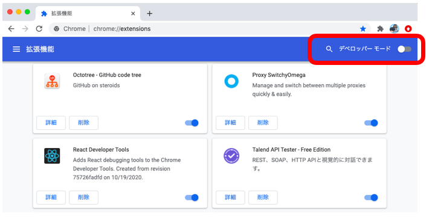
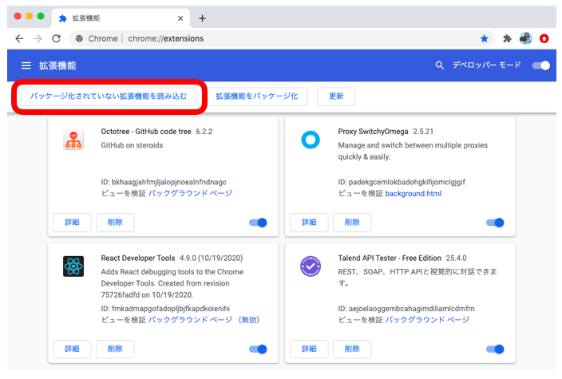
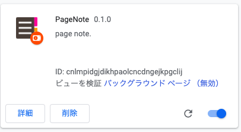

# page note

[TOC]

## how to install

npmがインストールされている必要があります。[こちら](https://nodejs.org/en/)からインストールしてください。

```shell
// リポジトリのクローン
$ git clone https://github.com/akubi0w1/page-
note.git

// ディレクトリを移動
$ cd page-note

// ブランチを切り替え
$ git checkout demo

// 依存パッケージのインストール
$ npm ci
```

## text summarization apiの導入

[TextSummarizationAPI](https://a3rt.recruit-tech.co.jp/product/TextSummarizationAPI/)公式より、API KEYを発行する。メールにて、APIキーを確認し、コピーしておく。

`src/common/secret.js`を作成する。

```javascript
// src/common/secret.js
export const TEXT_SUMMARIZATION_API = {
  // TODO: api keyをコピペ
  KEY: "xxxxxxxxxxxxxxx",
  URL: "https://api.a3rt.recruit-tech.co.jp/text_summarization/v1",
  METHOD: "POST"
};
```

## アプリケーションをビルドする

```
$ npm run build
```

成功すると、`dist`ディレクトリがあり、中にビルドされたコードがある。

## chrome extensionとして追加する

1. [拡張機能の管理画面](chrome://extensions/)にて、デベロッパーモードへ切り替えを行う。


2. `パッケージ化されていない拡張機能`ボタンより、本ディレクトリ(`page-note`)を選択する。


3. 以下画像のように、`PageNote`が追加されれば、本拡張機能が利用できる。

